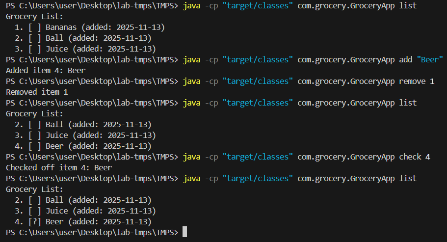
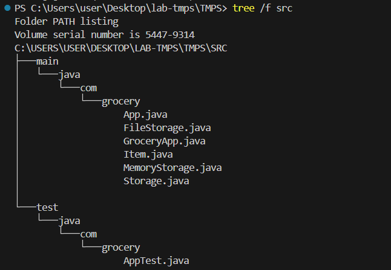

# SOLID Principles Laboratory Work

## Theory: What are SOLID Principles?

SOLID is an acronym for five design principles that make software designs more understandable, flexible, and maintainable. Created by Robert C. Martin (Uncle Bob), these principles help developers write better object-oriented code.

**The Five SOLID Principles:**
- **S** - Single Responsibility Principle (SRP)
- **O** - Open/Closed Principle (OCP)  
- **L** - Liskov Substitution Principle (LSP)
- **I** - Interface Segregation Principle (ISP)
- **D** - Dependency Inversion Principle (DIP)

## Purpose of the Laboratory

**Objective:** Implement a practical software application demonstrating three core SOLID principles: SRP, DIP, and OCP.

**Learning Goals:**
- Understand how SOLID principles improve code maintainability
- Practice separation of concerns through proper class design
- Implement dependency injection using interfaces
- Design extensible systems that are open for extension but closed for modification
- Write testable code using dependency inversion

## Project Idea: Grocery List CLI

A simple command-line grocery list application that allows users to manage their shopping items. The project is deliberately small to focus on design principles rather than complex functionality.

**Core Features:**
- Add items to grocery list
- View all items with status
- Mark items as bought/checked
- Remove items from list
- Persistent storage between sessions

**Why This Project:**
- Simple enough to understand quickly
- Complex enough to demonstrate all three SOLID principles
- Real-world applicable functionality
- Easy to test and extend

## Quick Start

```powershell
# Compile
javac -cp "." -d "target/classes" src/main/java/com/grocery/*.java

# Basic usage
java -cp "target/classes" com.grocery.GroceryApp add "Bananas"
java -cp "target/classes" com.grocery.GroceryApp add "Milk"
java -cp "target/classes" com.grocery.GroceryApp list
java -cp "target/classes" com.grocery.GroceryApp check 1
java -cp "target/classes" com.grocery.GroceryApp remove 2
```

## Available Commands

- `add "item name"` — Add item to list
- `list` — Show all items  
- `check <id>` — Mark item as bought ✓
- `remove <id>` — Delete item
- `clear` — Remove all items
- `help` — Show usage

## SOLID Principles Applied

### 1. Single Responsibility Principle (SRP)

**Implementation:**
- `Item.java` → Responsible only for data representation
- `Storage.java` → Defines only storage contract
- `App.java` → Contains only business logic operations
- `GroceryApp.java` → Handles only CLI parsing and delegation

**Benefit:** Changes to storage format don't affect business logic. Changes to CLI don't affect core functionality.

### 2. Dependency Inversion Principle (DIP)

**Implementation:**
- `App` class depends on `Storage` interface, not concrete implementations
- Tests use `MemoryStorage`, production uses `FileStorage`
- Same app code works with any storage type without modification

```java
// High-level module depends on abstraction
public class App {
    private final Storage storage;  // ← Interface, not concrete class
    
    public App(Storage storage) {   // ← Can accept any Storage implementation
        this.storage = storage;
    }
}
```

**Benefit:** Easy testing, swappable storage providers, isolated components.

### 3. Open/Closed Principle (OCP)

**Implementation:**
- New storage types (DatabaseStorage, CloudStorage) can be added by implementing `Storage` interface
- New commands can be added without modifying existing business logic
- Core App class remains unchanged when extending functionality

**Examples of Extension:**
```java
// Add new storage without changing existing code
public class DatabaseStorage implements Storage { ... }

// Add new command without changing App class
case "archive":
    handleArchive(app, args);
    break;
```

**Benefit:** System grows without breaking existing, tested code.

## Project Architecture

### File Structure

```
src/main/java/com/grocery/
├── Item.java          # Data model (SRP)
├── Storage.java       # Storage interface (DIP)
├── MemoryStorage.java # In-memory implementation (DIP, OCP)
├── FileStorage.java   # File-based implementation (DIP, OCP)
├── App.java           # Core business logic (SRP, DIP)
└── GroceryApp.java    # CLI entry point (SRP)

src/test/java/com/grocery/
└── AppTest.java       # Unit tests using MemoryStorage (DIP)
```

### Data Storage Format

Items are persisted to `grocery-list.json` using pipe-separated format:
```
1|Bananas|false|2025-10-10T16:59:18
2|Milk|true|2025-10-10T17:05:24
```

This simple format demonstrates the Storage abstraction - the App class doesn't need to know about file formats.

## Results

*This section contains screenshots demonstrating the application functionality and SOLID principles in action.*

### Application Execution




### Code Structure Demonstration




## Conclusion

This laboratory work successfully demonstrates the practical application of three fundamental SOLID principles:

**Key Achievements:**
1. **Single Responsibility Principle**: Each class has a clear, single purpose, making the codebase easy to understand and maintain.

2. **Dependency Inversion Principle**: The use of interfaces allows for flexible, testable code where high-level modules don't depend on low-level implementation details.

3. **Open/Closed Principle**: The system can be extended with new storage types or commands without modifying existing, working code.

**Benefits Realized:**
- **Maintainability**: Changes are localized to specific classes
- **Testability**: Easy unit testing through dependency injection
- **Extensibility**: New features can be added without breaking existing functionality
- **Flexibility**: Storage mechanisms can be swapped without affecting business logic

**Real-World Application:**
These principles are not just academic concepts but practical tools that lead to better software design. The grocery list application, while simple, demonstrates how SOLID principles create robust, maintainable code that can evolve with changing requirements.

The implementation proves that following SOLID principles doesn't add unnecessary complexity—instead, it creates a clean, logical structure that makes the code easier to work with and extend.

